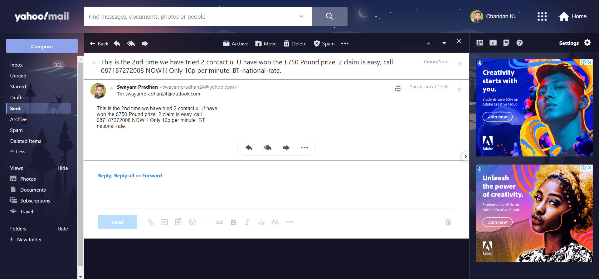

# Hey Everyone👋🏻,
# **IDTC-RPA-Task_Day2**
# Welcome to my **UIPath Aut⚙mation** on **"Email Classification"**
---
- ## I am [Chandan Kumar Pradhan](https://www.linkedin.com/in/chandan-kumar-pradhan-0788361a0). A RPA Enthusiast.  I earned today real out-of-the-box knowledge on `Language Detection` and `English Text Classification` like ML Skill sets on _**UIPath Studio**_. How to train a ML model and stuffs learned in another IDTC RPA tech camp associated with **UIPath** & **WonderBotz** organized by **IncubateIND**.

- ## Really I learned about **Robotic Process Automation with AI Center** from my mentor [Nisarg Kadam](https://www.linkedin.com/in/nisargkadam/) and  [Parth Doshi](https://www.linkedin.com/in/parth-doshi-learning-by-doing/). Thanks for conducting this kind of tech camps [Anuj Sharma](https://www.linkedin.com/in/anujsharma378/), [Kaushik Roy](https://www.linkedin.com/in/kroy96/).
- ## I did today's task📝 successfully but yes it's tricky and somewhat easy😀.
  

## **Task_1: Intelligent Email Classifier**
---
>- **Step 1** - Created a Project in AI Center named `Intelligent Email Classifier`.
 

>- **Step 2** - Uploaded the dataset and trained the model with the dataset.

>- **Step 3** - Created an UIpath [workflow](./Spam_Email_Prediction/Main.xaml).

>- **Step 4** - Emailed my self. And after run let the bot read the body and decide whether the email spam or not.

>- **Step 5** - Classified emails whether they *spam* or not.

(Bot decided to move the email to 'junk folder')

## **Task_2 : AI enabled Email Classifier**
---
>- **Step 1** - Created 2 ML Projects in AI Center Sentiment Analysis & Language Detection.Deployed 2 ML Skills - Non retrainable models `1.` Language Analysis - SentimentAnalysis `2.` Language Analysis - LanguageDetection

>- **Step 2** - Create a UiPath Workflow as follows.

>- **Step 3** - Input: 20 Emails in different langugages as follows: `a.` 5 - English Language Emails `b.` 5 - Russian Language Emails `c.` 5 - Hindi Langugage Emails `d.` 5 - French Emails.
Created 4 Folders - For each language in Email.
>- **Step 4** - Using Language Detection classified all the emails to respective folders.

>- **Step 5** - Final Sentiment Analysis and output: Excel_file.

# **Thank You ❤ IncubateIND || UIPath || WonderBotz.**
